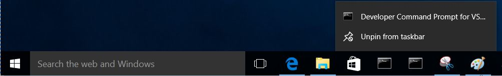

# Microsoft Windows 10 – Visual Studio command prompt {#microsoft-windows-10-visual-studio-command-prompt}

| **Step** | **Action** |
| --- | --- |
|  | **Open** Microsoft Visual Studio 2013 command prompt |
|  | **Using the Start menu in Windows 10,** |
|  | **Left-click** on “All apps” Windows 8 (Window 10 use scroll bar next step below) |
|  | **Scroll down** from the scroll bar on the right until **“Visual Studio 2013”** |
|  | **Left Click** “Visual Studio 201n” |
|  | **Left Click** “Visual Studio Tools” |
|  | **Another window will open** |
|  | **Left Click** on “Pin to taskbar” |
|  |  |